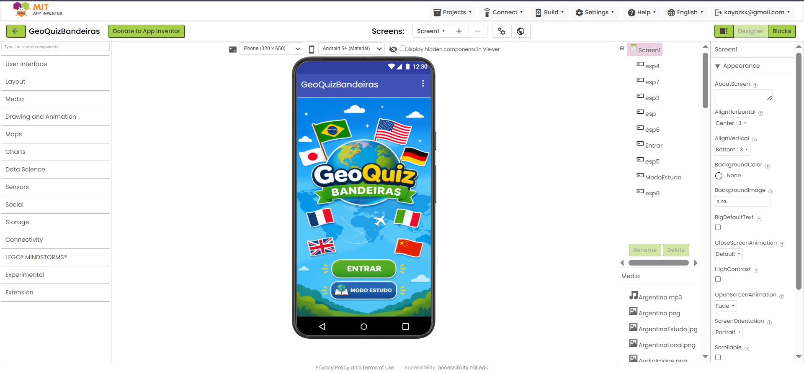
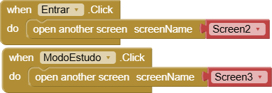
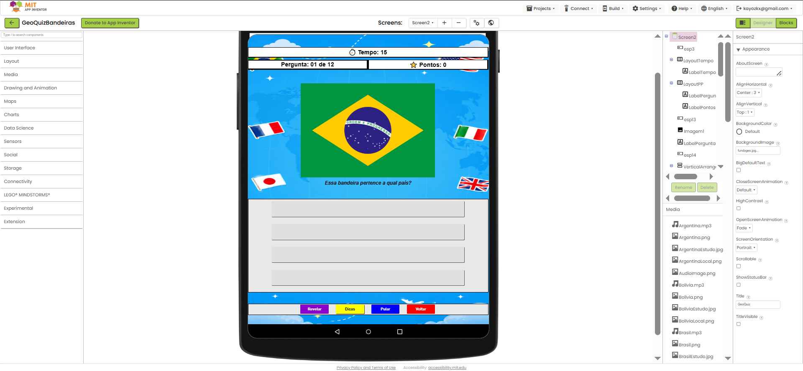
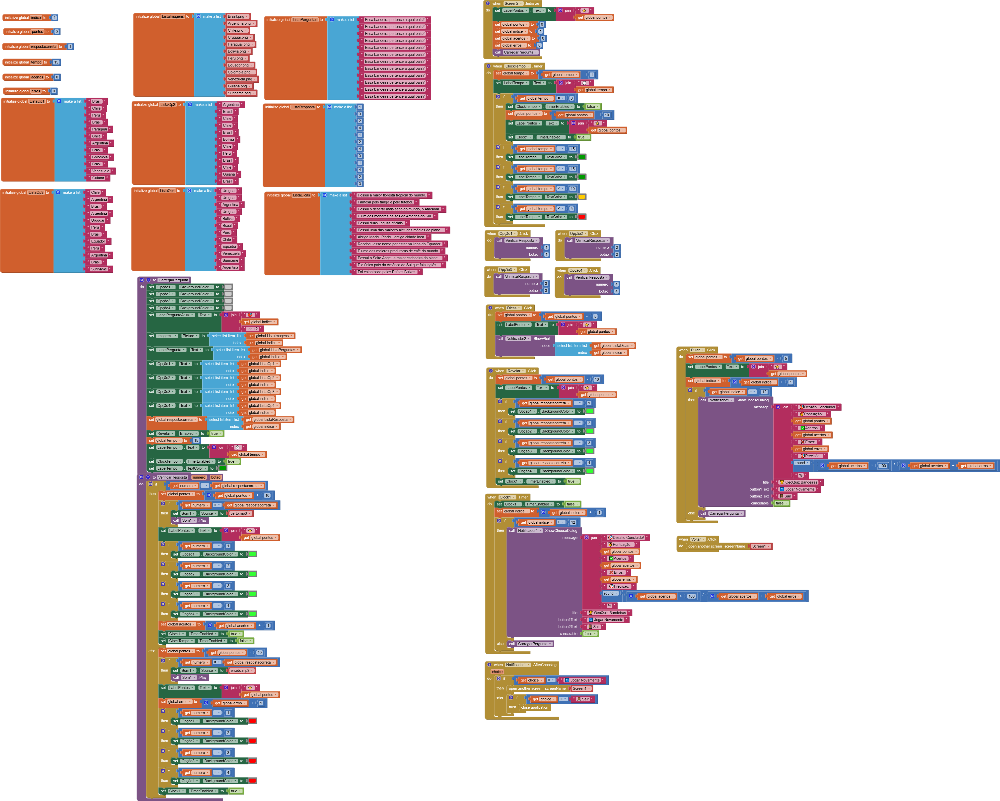
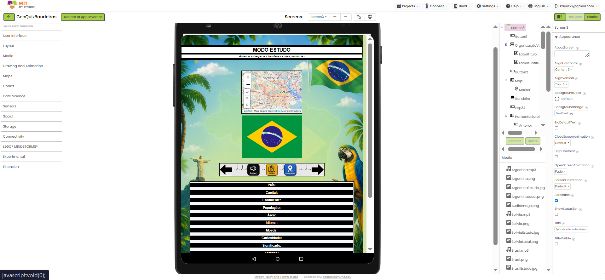
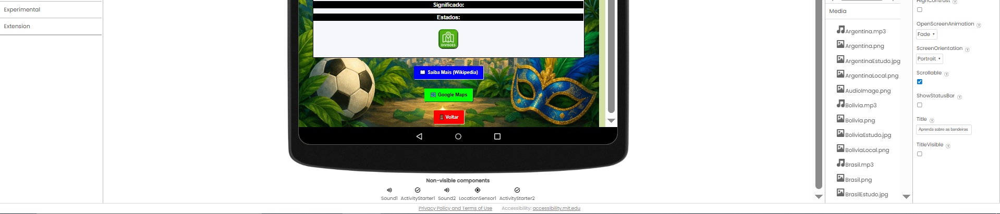
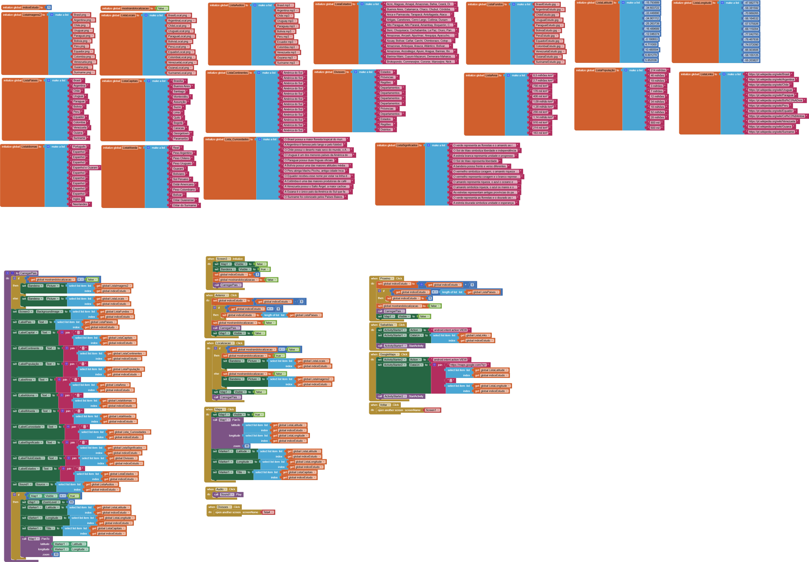
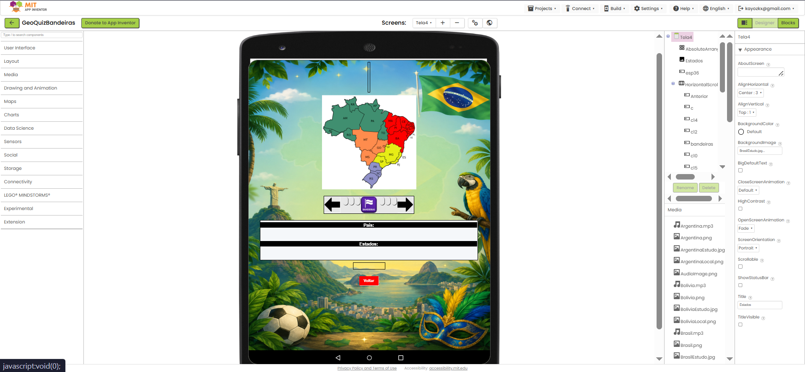
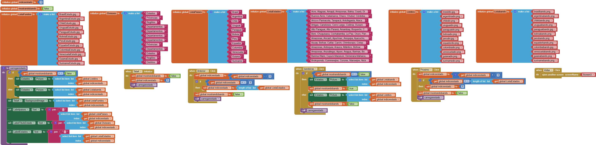

# GeoQuizMIT
Quiz educativo de bandeiras da América do Sul com Modo Estudo, feito no MIT App Inventor.

# 🌎 GeoQuiz Bandeiras

Aplicativo educativo desenvolvido no MIT App Inventor para Android. Teste seus conhecimentos sobre os países da América do Sul através de um quiz de bandeiras, e aprenda sobre cada país no Modo Estudo.

> Projeto pessoal desenvolvido para fins de aprendizado e testes.

---

## 📱 Telas do Aplicativo

### Tela 1 — Menu Principal

Tela inicial com duas opções de acesso.

#### Blocos — Menu Principal

Os blocos da tela inicial são simples: cada botão abre uma tela diferente.

- **Botão ENTRAR** → abre a `Screen2` (Quiz)
- **Botão MODO ESTUDO** → abre a `Screen3` (Modo Estudo)

---

### Tela 2 — Quiz

O quiz apresenta 12 perguntas sobre bandeiras dos países da América do Sul. Cada pergunta tem 4 opções de resposta e um contador regressivo de 15 segundos.

#### Funcionalidades
- ⏱️ **Tempo:** 15 segundos por pergunta com barra de progresso visual
- 🏆 **Pontuação:** exibida em tempo real
- 💡 **Dica:** revela uma curiosidade sobre o país
- 👁️ **Revelar:** mostra a resposta correta
- ⏭️ **Pular:** avança para a próxima pergunta sem pontuar
- 🔙 **Voltar:** retorna ao menu principal

#### Blocos — Quiz

Os blocos desta tela controlam toda a lógica do quiz:

- **Listas de dados:** imagens das bandeiras, perguntas, respostas corretas e opções embaralhadas são armazenadas em listas globais
- **CarregarPergunta:** função principal que sorteia uma bandeira aleatória, define as 4 opções de resposta e inicia o timer
- **Clock (Timer):** a cada tick decrementa o tempo; quando chega a zero passa automaticamente para a próxima pergunta
- **VerificarResposta:** compara a opção clicada com a resposta correta, atualiza a pontuação e muda a cor do botão (verde = acerto, vermelho = erro)
- **Revelar / Dica / Pular:** blocos auxiliares que expõem informações ou avançam o índice da pergunta
- **Fim do Quiz:** quando as 12 perguntas acabam, exibe um dialog com a pontuação final e opções de jogar novamente ou voltar ao menu

---

### Tela 3 — Modo Estudo

Permite aprender sobre cada país da América do Sul com informações detalhadas, mapa interativo e recursos externos.

#### Informações exibidas por país
- País, Capital, Continente
- População, Área, Idioma
- Moeda, Curiosidade, Significado da bandeira
- Estados/Divisões territoriais

#### Funcionalidades
- 🔊 **Áudio:** pronuncia o nome do país no idioma local
- 📍 **Localização:** exibe no mapa a posição do país na América do Sul
- 🗺️ **Mapa:** abre o mapa com as coordenadas exatas da capital
- 🌐 **Saiba Mais:** abre a página da Wikipedia do país
- 📌 **Google Maps:** abre o Google Maps com as coordenadas da capital
- ➡️ **Divisões:** navega para a Tela 4 com as divisões territoriais do país
- ◀️▶️ **Navegação:** botões para avançar e voltar entre os países

#### Blocos — Modo Estudo

- **Listas globais:** cada país tem suas próprias listas de dados (nome, capital, população, área, idioma, moeda, curiosidade, significado, estados, coordenadas latitude/longitude, links Wikipedia)
- **CarregarPais:** função central que carrega todos os dados do índice atual e preenche todos os labels da tela
- **Mapa:** usa o componente Map do MIT App Inventor com latitude e longitude de cada capital para posicionar o marcador
- **Anterior / Próximo:** decrementam ou incrementam o índice global e chamam CarregarPais
- **Áudio:** usa o componente Sound para tocar o arquivo mp3 com a pronúncia do nome do país
- **ActivityStarter (Wikipedia):** abre o navegador com a URL da Wikipedia do país usando `android.intent.action.VIEW`
- **ActivityStarter (Google Maps):** monta a URL `https://maps.google.com/?q=latitude,longitude` e abre no Maps
- **Botão Divisões:** passa o índice atual para a Screen4 via `open another screen with start value`

---

### Tela 4 — Divisões Territoriais

Exibe as divisões administrativas (estados, departamentos, províncias ou regiões) de cada país com suas respectivas bandeiras.

#### Funcionalidades
- 🗺️ Mapa do país com divisões coloridas
- 📋 Lista de todos os estados/departamentos/províncias
- 🏳️ **Botão Bandeiras:** alterna entre o mapa padrão e o mapa com as bandeiras de cada divisão territorial
- ◀️▶️ Navegação entre países
- 🔙 **Voltar:** retorna ao Modo Estudo

#### Blocos — Divisões

- **Listas globais:** listas de divisões, bandeiras das divisões e imagens dos mapas por país
- **carregarestado:** função principal que carrega o mapa, nome do país, lista de estados e a bandeira de fundo conforme o índice
- **Botão Bandeiras:** alterna a variável `mostrandobands` entre `true` e `false`, trocando a imagem exibida entre mapa normal e mapa com bandeiras das divisões
- **Anterior / Próximo:** navegação entre países com verificação de limite de lista
- **Voltar:** retorna para a Screen3 (Modo Estudo)

---

## 🌍 Países incluídos

Todos os 12 países da América do Sul:

| País | Capital |
|------|---------|
| 🇧🇷 Brasil | Brasília |
| 🇦🇷 Argentina | Buenos Aires |
| 🇨🇱 Chile | Santiago |
| 🇺🇾 Uruguai | Montevidéu |
| 🇵🇾 Paraguai | Assunção |
| 🇧🇴 Bolívia | Sucre / La Paz |
| 🇵🇪 Peru | Lima |
| 🇪🇨 Equador | Quito |
| 🇨🇴 Colômbia | Bogotá |
| 🇻🇪 Venezuela | Caracas |
| 🇬🇾 Guiana | Georgetown |
| 🇸🇷 Suriname | Paramaribo |

---

## 🛠️ Tecnologias utilizadas

- MIT App Inventor
- Android
- Google Maps (via ActivityStarter)
- Wikipedia (via ActivityStarter)

---

## 🔁 Como replicar

1. Acesse [MIT App Inventor](https://appinventor.mit.edu)
2. Crie um novo projeto
3. Recrie as 4 telas conforme as imagens e blocos documentados acima
4. Adicione os assets (imagens das bandeiras, mapas, áudios) na aba **Media**
5. Monte os blocos seguindo a documentação de cada tela
6. Compile e teste no celular via **MIT AI2 Companion** ou gerando o APK

Caso prefira, baixe o arquivo `GeoQuizBandeiras.aia` e importe diretamente no MIT App Inventor em vez de recriar do zero:

Projects → Import project (.aia)

---

## ✏️ Autor

Desenvolvido por **Kayozkx**  
Projeto educativo pessoal — América do Sul

---

> Este repositório documenta a lógica e estrutura do app para quem quiser replicar ou aprender com o projeto.
